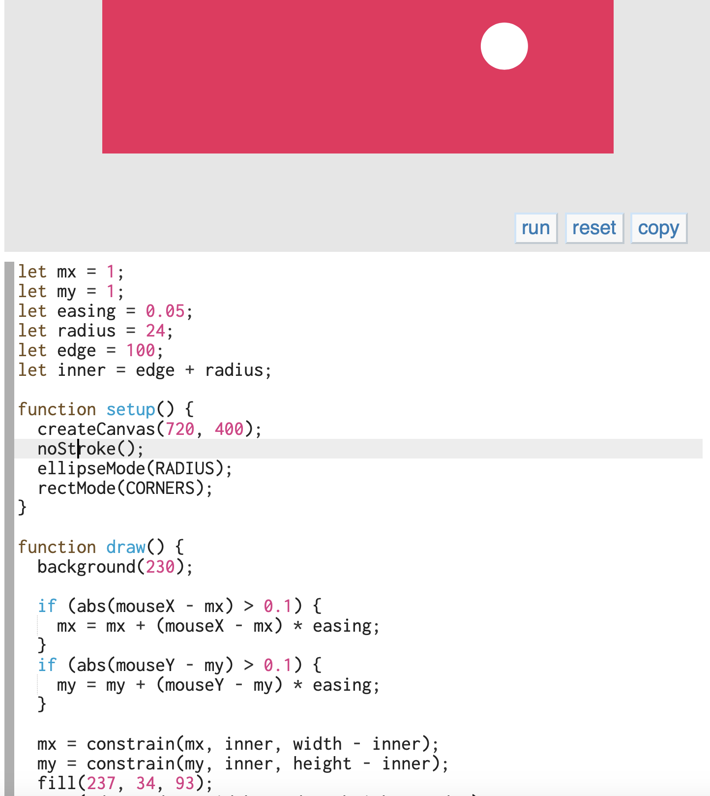

# IDEA9103_Quiz8
## Quiz 8 submission

### Part 1: Imaging Technique Inspiration
Broadway Boogie Woogie is an artwork consists of red, white, blue and yellow rectangles represent city-grid of Manhattan. I have looked at a digital interactive wall which is also consisted of simple shapes which can be a shared character in these two things. It starts with structured format, but audience can interact with the wall, moving the shape or create circles to interrupt the structure. At this point, I am thinking the city-grid should also be reconstructed with music as the artwork also get inspired by African-American Blues music. 

[Link of the interactive wall](https://www.youtube.com/watch?v=G2ptGCwDkVE);

### Part 2: Coding Technique Exploration
There will be some coding techniques relate to mouse, including click. Inside constrain technique, there is something that defines the position of the shape which makes the shape follow the movement of the mouse. This is what I think can be used in the project which is relate to the purpose as this allows the audience to control the shape they have made to move around canvas with some delay. While click and release maybe can be used to create the shape they want. 

[Link of the sample that the shape follows the mouse](https://p5js.org/examples/input-constrain.html)
[Link of mouse interaction](https://p5js.org/examples/input-mouse-functions.html)