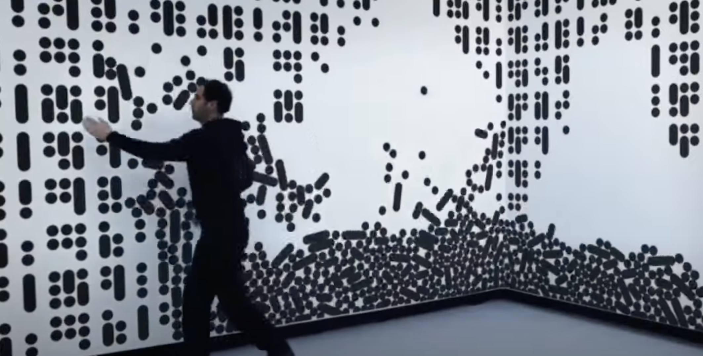
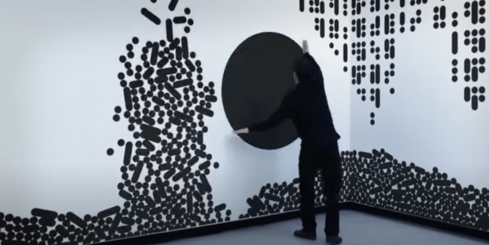
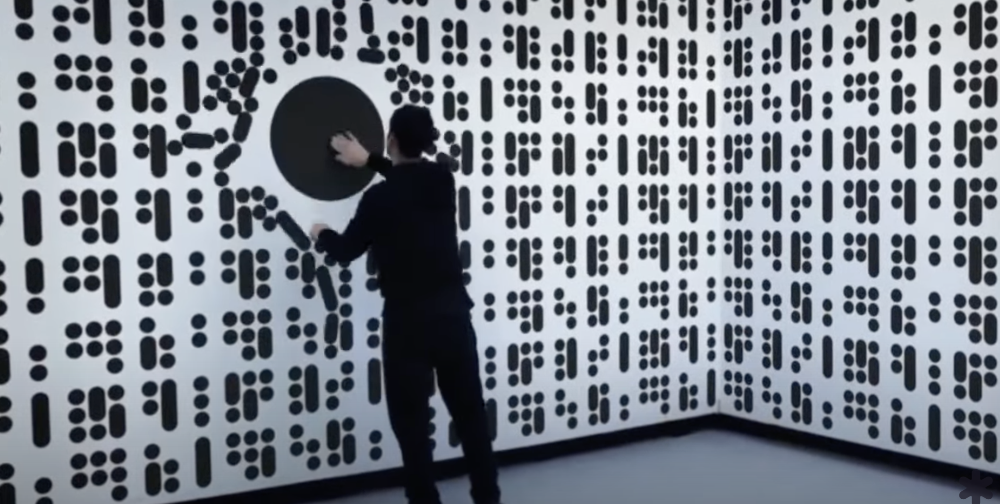

# IDEA9103_Quiz8
## Quiz 8 submission

### Part 1: Imaging Technique Inspiration
Broadway Boogie Woogie is an artwork consists of red, white, blue and yellow rectangles represent city-grid of Manhattan. I have looked at a digital interactive wall which is also consisted of simple shapes which can be a shared character in these two things. It starts with structured format, but audience can interact with the wall, moving the shape or create circles to interrupt the structure. At this point, I am thinking the city-grid should also be reconstructed with music as the artwork also get inspired by African-American Blues music. 

[Link of the interactive wall](https://www.youtube.com/watch?v=G2ptGCwDkVE);

### Part 2: Coding Technique Exploration
